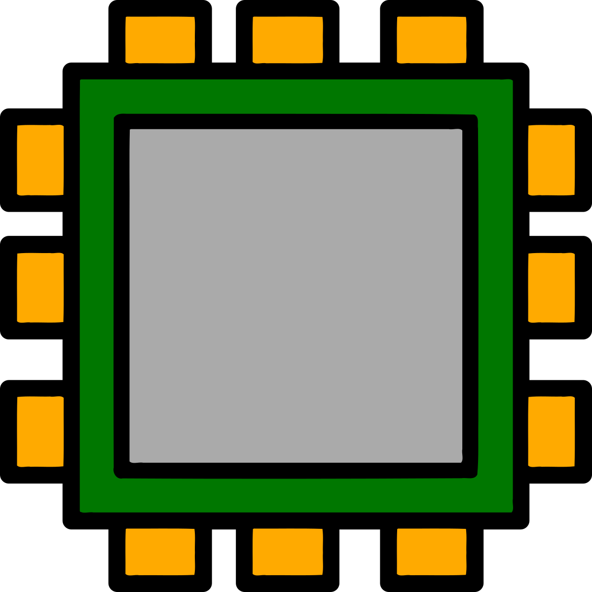

# Niru

    

    <strong>
        A full-system computer emulator written in C#.
    </strong>

---

**Warning:** This is currently in-development vaporware.

**Niru** provides libraries and end-user tools for emulating foreign CPU
architectures and various other hardware components on any machine that .NET
runs on.

**Niru** dynamically translates blocks of guest architecture code to a generic
intermediate representation, optimizes the code, and then passes it off to an
execution module which either compiles the IR to host architecture code and runs
it, or interprets the IR directly if just-in-time compilation is not supported
on the host platform. As a result of this design, **Niru** can be easily ported
to new guest and host architectures.

## Usage

This project offers the following packages:

| Package | Description | Downloads |
| -: | - | :- |
| [![niru][cli-img]][cli-pkg] | Provides the .NET global tool. | ![Downloads][cli-dls] |
| [![Vezel.Niru][core-img]][core-pkg] | Provides shared emulation functionality used by all guests and hosts. | ![Downloads][core-dls] |
| [![Vezel.Niru.Guests.Riscv][guests-riscv-img]][guests-riscv-pkg] | Provides emulation for RISC-V guests. | ![Downloads][guests-riscv-dls] |
| [![Vezel.Niru.Hosts.X64][hosts-x64-img]][hosts-x64-pkg] | Provides just-in-time compilation for x64 hosts. | ![Downloads][hosts-x64-dls] |
| [![Vezel.Niru.Hosts.Arm64][hosts-arm64-img]][hosts-arm64-pkg] | Provides just-in-time compilation for Arm64 hosts. | ![Downloads][hosts-arm64-dls] |
| [![Vezel.Niru.Hosts.Cil][hosts-cil-img]][hosts-cil-pkg] | Provides just-in-time compilation through the .NET runtime. | ![Downloads][hosts-cil-dls] |
| [![Vezel.Niru.Hosts.Interpreter][hosts-interpreter-img]][hosts-interpreter-pkg] | Provides interpretation for hosts that disallow just-in-time compilation. | ![Downloads][hosts-interpreter-dls] |

[cli-pkg]: https://www.nuget.org/packages/niru
[core-pkg]: https://www.nuget.org/packages/Vezel.Niru
[guests-riscv-pkg]: https://www.nuget.org/packages/Vezel.Niru.Guests.Riscv
[hosts-x64-pkg]: https://www.nuget.org/packages/Vezel.Niru.Hosts.X64
[hosts-arm64-pkg]: https://www.nuget.org/packages/Vezel.Niru.Hosts.Arm64
[hosts-cil-pkg]: https://www.nuget.org/packages/Vezel.Niru.Hosts.Cil
[hosts-interpreter-pkg]: https://www.nuget.org/packages/Vezel.Niru.Hosts.Interpreter

[cli-img]: https://img.shields.io/nuget/v/niru?label=niru
[core-img]: https://img.shields.io/nuget/v/Vezel.Niru?label=Vezel.Niru
[guests-riscv-img]: https://img.shields.io/nuget/v/Vezel.Niru.Guests.Riscv?label=Vezel.Niru.Guests.Riscv
[hosts-x64-img]: https://img.shields.io/nuget/v/Vezel.Niru.Hosts.X64?label=Vezel.Niru.Hosts.X64
[hosts-arm64-img]: https://img.shields.io/nuget/v/Vezel.Niru.Hosts.Arm64?label=Vezel.Niru.Hosts.Arm64
[hosts-cil-img]: https://img.shields.io/nuget/v/Vezel.Niru.Hosts.Cil?label=Vezel.Niru.Hosts.Cil
[hosts-interpreter-img]: https://img.shields.io/nuget/v/Vezel.Niru.Hosts.Interpreter?label=Vezel.Niru.Hosts.Interpreter

[cli-dls]: https://img.shields.io/nuget/dt/niru?label=
[core-dls]: https://img.shields.io/nuget/dt/Vezel.Niru?label=
[guests-riscv-dls]: https://img.shields.io/nuget/dt/Vezel.Niru.Guests.Riscv?label=
[hosts-x64-dls]: https://img.shields.io/nuget/dt/Vezel.Niru.Hosts.X64?label=
[hosts-arm64-dls]: https://img.shields.io/nuget/dt/Vezel.Niru.Hosts.Arm64?label=
[hosts-cil-dls]: https://img.shields.io/nuget/dt/Vezel.Niru.Hosts.Cil?label=
[hosts-interpreter-dls]: https://img.shields.io/nuget/dt/Vezel.Niru.Hosts.Interpreter?label=

To install a tool package in a project, run `dotnet tool install <name>`. To
install it globally, also pass `-g`.

To install a library package, run `dotnet add package <name>`.

For more information, please visit the
[project home page](https://docs.vezel.dev/niru).

## License

This project is licensed under the terms found in
[`LICENSE-0BSD`](LICENSE-0BSD).
